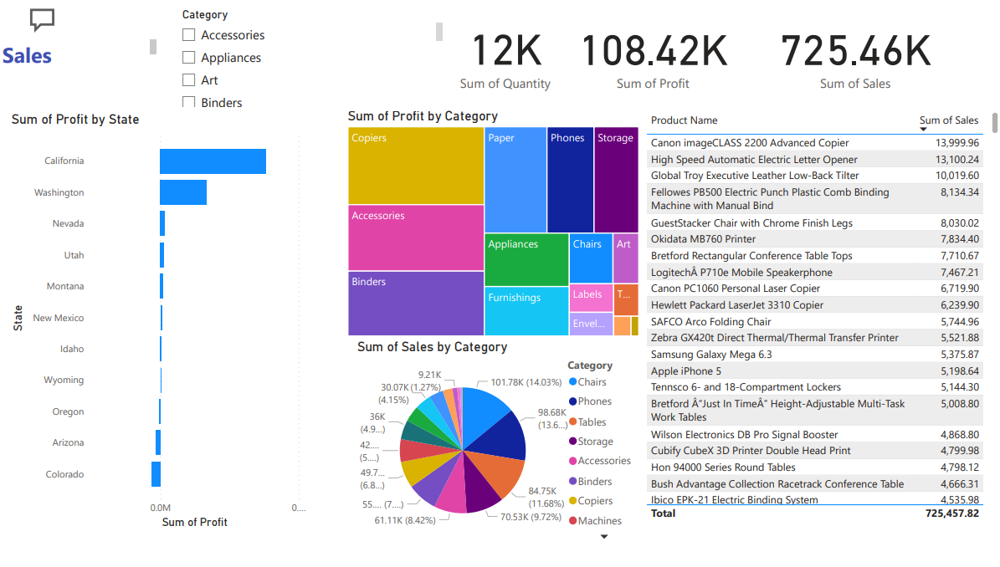

# Walmart Store Sales Dashboard (Power BI)

An interactive **Power BI dashboard** built to analyze Walmart store sales performance across **categories, states, cities, products, and time**.  
This project helps identify top-selling products, profit-driving segments, and location-based trends for better business decisions.

  

## Dashboard Highlights

### Key KPIs
- **Total Sales:** 725.46K  
- **Total Profit:** 108.42K  
- **Total Quantity:** 12K  

### Insights Covered
- **Profit by State** (Top performing states like California, Washington, etc.)
- **Sales by Category** (category contribution using charts)
- **Profit by Category** (treemap view for quick comparison)
- **Top Products by Sales** (product-wise ranking table)
- **Profit by Customer Name**
- **Profit by City**
- **Profit by Product Name**
- **Time-based Profit View** (Year / Quarter / Month / Day)

## Tools Used
- **Microsoft Power BI**
- **Excel / CSV Dataset** (source data)
- **DAX** (measures and calculations)

## File Included
- `Walmart Store Sales Dashboard.pbix` (Power BI report file)
- `Walmart.xlsx` (dataset)

## How to Use
1. Download the `.pbix` file
2. Open it in **Power BI Desktop**
3. Use slicers/filters to explore sales and profit across:
   - Category
   - Location (State/City)
   - Product
   - Date hierarchy

## Project Goal
To build a clean and interactive BI dashboard that provides:
- quick performance overview (KPIs)
- product/category breakdown
- location-wise profitability analysis
- decision-ready insights for business stakeholders
